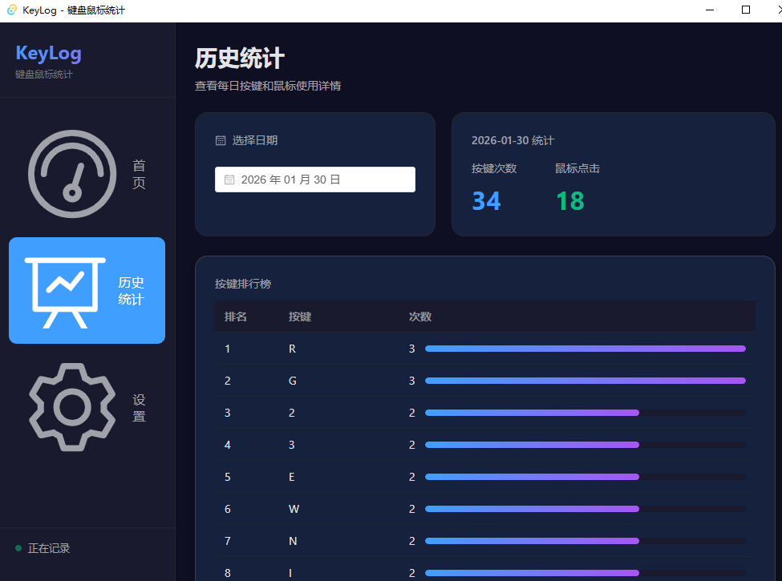

# KeyLog 📊

KeyLog 是一款基于 **Tauri 2.0** 构建的现代化、高性能、轻量级键盘鼠标统计工具。它运行在您的桌面上，默默记录您的输入习惯，帮助您回顾工作效率与数码生活。

[](LICENSE)
[](https://tauri.app/)
[](https://vuejs.org/)
[](https://www.rust-lang.org/)

## 📸 软件截图

### 首页仪表盘


### 历史统计回顾


### 个性化设置


## ✨ 主要特性

- **🔒 隐私优先**：所有数据均存储在本地 SQLite 数据库中 (`%LOCALAPPDATA%\KeyLog\keylog.db`)，没有任何数据上传服务器。
- **⚡ 极致性能**：
  - 后端采用 **Rust** 编写，内存占用极低。
  - 智能 **缓冲写入** 策略（每 50 个事件或 3 秒写入一次），确保磁盘 I/O 降至最低。
- **🎨 现代界面**：
  - 基于 **Vue 3** + **Element Plus** 的美观 UI。
  - 支持 **深色模式** 带来的沉浸体验。
  - 实时数据可视化图表 (ECharts)。
- **⚙️ 高级配置**：
  - **设置持久化**：支持开机自启动、最小化到托盘等个性化配置。
  - **多格式导出**：支持按日期范围导出 CSV 汇总报告，或导出 Excel 文件（每个日期自动生成独立 Sheet 页）。
- **📈 丰富统计**：
  - **今日仪表盘**：实时展示按键总数、鼠标点击数、高频按键排行。
  - **历史回顾**：支持查看任意日期的详细统计，以及过去 30 天的趋势图表。

## 📝 待办事项 (TODO)

- [x] **自定义数据存储**：支持手动设置数据库文件的存储位置。
- [x] **滚轮统计**：增加鼠标滚轮统计功能，分别记录向上滚动和向下滚动的次数。
- [x] **托盘模式优化**：最小化时隐藏任务栏图标，仅在系统托盘显示。

## 🛠️ 技术栈

- **前端**：Vue 3, TypeScript, Pinia, Vue Router, Element Plus, ECharts
- **后端**：Rust, Tauri 2.0, SQLite (rusqlite), rdev (跨平台输入监听)
- **构建工具**：Vite, pnpm

## 🚀 快速开始

### 开发环境

确保您已安装 Rust 和 Node.js 环境。

```bash
# 安装依赖
pnpm install

# 启动开发服务器
pnpm tauri dev
```

### 构建生产版本

```bash
pnpm tauri build
```
构建后的安装包将位于 `src-tauri/target/release/bundle/` 目录下。

## 📖 使用指南

1. **自动记录**：启动应用后，它会自动开始记录。您可以最小化窗口，它会在后台静默运行。
2. **数据查看**：点击左侧导航栏切换首页仪表盘或历史统计。
3. **导出数据**：在设置页面选择日期范围，可导出 CSV 或 Excel 报告。
4. **开机自启**：在设置页面开启，软件将随系统自动启动并开始监听。

## ❓ 常见问题

**Q: 杀毒软件报毒？**
A: 由于涉及全局键盘监听钩子（统计软件的核心原理），部分安全软件可能会误报。请将应用加入白名单。本项目代码完全开源，不包含任何恶意行为。

**Q: 数据实时性如何？**
A: 应用使用了缓冲策略以保护磁盘寿命，数据通常会有 3 秒左右的延迟显示在界面上。

## � 更新日志

### v0.2.0 (2026-02-08)

- **✨ 新增功能**
  - **自定义数据存储**：用户现在可以在设置页面手动选择数据库存储路径，支持热切换，无需重启应用。
  - **滚轮统计**：新增鼠标滚轮使用统计，分别记录向上和向下滚动的次数。
  - **托盘模式优化**：点击最小化按钮时自动隐藏任务栏图标，仅在系统托盘保留图标，减少对工作的干扰。

- **🔧 优化**
  - 优化了数据库连接管理机制，支持动态重连。
  - 完善了设置页面的交互体验。

### v0.1.0

- 初始版本发布
- 基础键盘鼠标统计功能
- 每日/历史数据可视化
- CSV/Excel 导出功能

## �📄 许可证

本项目采用 [MIT License](LICENSE) 开源。
